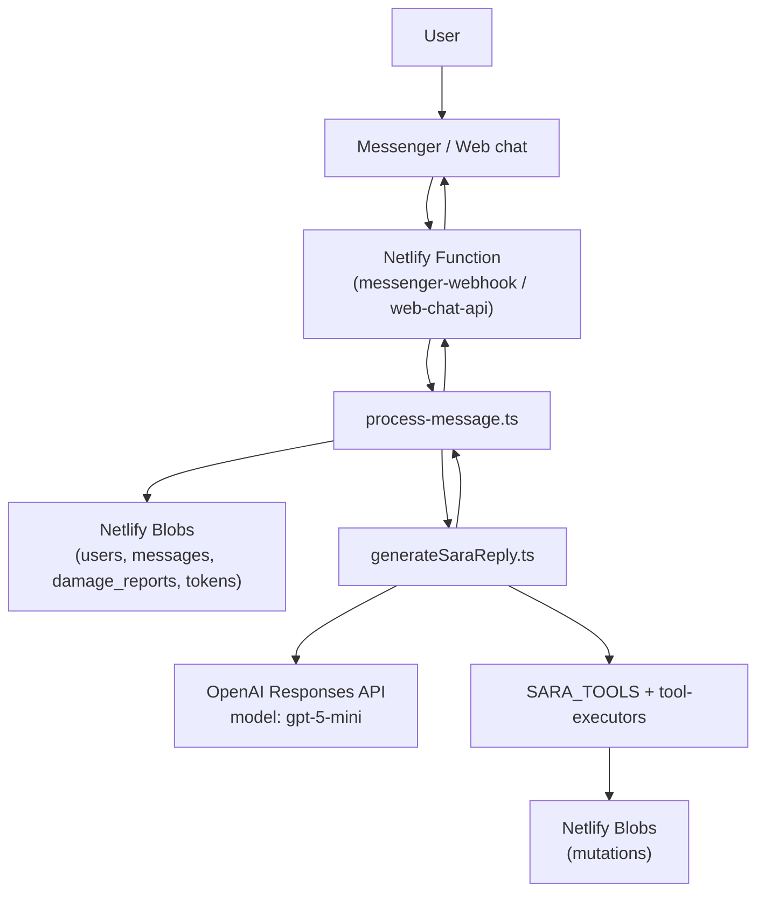

## Curson Sara – Architecture & System Design

This document gives a full picture of how Curson Sara works: request flow, data model, LLM integration, Netlify Functions, and external channels.

---

## 1. High‑Level Flow

Every user message (Messenger or web chat) follows the same path: normalize → load state → single LLM turn → optional tools → persist → reply.



- `Netlify Functions` are the HTTP entrypoints per channel.
- `process-message.ts` is the channel‑agnostic orchestrator.
- `generateSaraReply.ts` is the *only* LLM entrypoint.
- Tools (`SARA_TOOLS` + `tool-executors.ts`) are the only way the LLM reads/writes structured data.

---

## 2. Components & Responsibilities

### 2.1 Netlify Functions

- `netlify/functions/messenger-webhook.ts`
  - Handles Facebook webhook verification (`GET` with `hub.*` params).
  - Normalizes incoming Messenger events into `IncomingMessage`:
    - `senderId`: PSID
    - `text`: `message.text` or `""`
    - `mediaUrls`: extracted from `message.attachments` where `type === "image"`
    - `timestamp`, `rawPayload`
  - Calls `processMessage`.
  - Sends the reply back via Facebook Graph API.

- `netlify/functions/web-chat-api.ts`
  - Simple JSON API for the embedded web chat widget.
  - Accepts `{ sessionId, text, name? }` over POST.
  - Builds `IncomingMessage` with `channel: "web"`, then calls `processMessage`.
  - Returns `{ replyText }` JSON.

### 2.2 Orchestrator (`process-message.ts`)

- Type: `IncomingMessage`:
  - `senderId: string`
  - `text: string`
  - `channel: "messenger" | "web"`
  - `timestamp: number`
  - `rawPayload: unknown`
  - `nameHint?: string`
  - `mediaUrls?: string[]` – image URLs attached to this turn.
- Steps:
  1. `getOrCreateUser(channel, senderId, nameHint)` → `UserProfileBlob`.
  2. Load:
     - `history = getMessagesForUser(user.id)` (full message history).
     - `reports = getUserReports(user.id)` (all damage reports for that user).
  3. Build `userProfileForLlm = toLlmUserProfile(user, reports)`:
     - Compact view with report IDs, statuses, and addresses.
  4. Call `generateSaraReply({ text, userProfile, messages: history, senderId })`.
  5. Append new messages:
     - User message `{ text, mediaUrls? }`.
     - Assistant reply `{ text: replyText }`.
     - Persist via `appendMessagesForUser(user.id, newMessages)`.
  6. Return `{ replyText }` for the channel‑specific function to send.

### 2.3 LLM Core & Tools

- `src/llm/openai-client.ts`
  - Wraps the OpenAI Node client.
  - Default model: `SARA_MODEL` env or `'gpt-5-mini'`.

- `src/llm/llm-core.ts`
  - Thin wrapper `callResponses({ model?, messages, tools? })`.
  - Uses the **Responses API**:
    - `client.responses.create({ model, input: [{ role, content }...], tools })`
  - Normalizes:
    - `assistantText` from `response.output_text`.
    - `toolCalls` from items of type `function_call` in `response.output`.

- `src/llm/tools.ts`
  - Defines `SARA_TOOLS: Tool[]` as strict JSON‑schema function tools:
    - `start_damage_report`
    - `update_damage_report_section`
    - `get_report_details`
    - `list_user_reports`
    - `update_report_address`
    - `update_report_photos`
    - `delete_report`
    - `mark_report_resolved`
    - `create_time_limited_report_link`
  - Enforces:
    - `parameters.type === "object"`.
    - `additionalProperties: false`.
    - `required` includes every key in `properties` for strict tools.

- `src/llm/tool-executors.ts`
  - Implements `executeToolCall(toolName, args, context)`:
    - Uses helpers from `utils/blobs.ts`.
    - Validates ownership and status transitions.
  - Examples:
    - `start_damage_report({ address })` → new pending report blob.
    - `update_report_photos({ reportId, photoUrls })` → replaces `photoUrls`.
    - `create_time_limited_report_link({ reportId, ttlHours? })` → creates token and returns URL.

### 2.4 Domain‑Level LLM Wrapper (`generateSaraReply.ts`)

- Shapes the full context and prompt for Sara.
- System prompt documents:
  - Sara’s persona and scope.
  - The structure of `USER_PROFILE` and `CONVERSATION_MESSAGES`.
  - That **all** reads/writes must go through tools.
  - How to use `mediaUrls` when present on a user message.
- Flow:
  1. Build context:
     - `USER_PROFILE` JSON string.
     - `CONVERSATION_MESSAGES` JSON array of:
       - `direction`, `text`, `mediaUrls[]`, `createdAt`.
  2. First `callResponses` with tools enabled.
  3. If no `toolCalls` → return assistant text directly.
  4. If there are `toolCalls`:
     - Execute each via `executeToolCall`.
     - Build a `TOOL_RESULTS` summary.
     - Make a follow‑up `callResponses` including:
       - Original system + context + user message.
       - Assistant interim text (what it “did”).
       - `TOOL_RESULTS` for explanation.
  5. Return the final assistant reply.

---

## 3. Data Model & Netlify Blobs Layout

### 3.1 Users

**Blob store**: `users`  
**Key format**: `"{channel}:{channelUserId}.json"` (e.g. `messenger:25577...json`)

`UserProfileBlob` (stored):

```ts
{
  id: string;              // internal user id, e.g. "messenger-2557..."
  channel: "messenger" | "web";
  channelUserId: string;   // raw PSID or web sessionId
  name?: string;
  reportIdsWithStatus?: Array<{ id: string; status: string; address?: string }>;
  createdAt: string;       // ISO
  updatedAt: string;       // ISO
}
```

For the LLM, we derive a compact profile each turn:

```ts
UserProfileForLlm = {
  id: string;
  name?: string;
  channel: "messenger" | "web";
  reportIdsWithStatus: Array<{ id: string; status: string; address?: string }>;
}
```

### 3.2 Messages

**Blob store**: `messages`  
**Key format**: `"{userId}.json"` (one blob per user)

`MessageBlob`:

```ts
{
  id: string;
  userId: string;
  direction: "user" | "assistant";
  contents: {
    text: string;
    mediaUrls?: string[]; // image URLs attached to this message, if any
  };
  createdAt: string; // ISO
}
```

- On each turn, we:
  - Load the **entire** array for that user.
  - Append a new `user` + `assistant` pair and write it back.
- The full array is sent as `CONVERSATION_MESSAGES` in the LLM context.

### 3.3 Damage Reports

**Blob store**: `damage_reports`  
**Key format**: `"{userId}/{reportId}.json"`

`DamageReportBlob`:

```ts
{
  id: string;
  userId: string;
  address?: string;
  status: "pending" | "completed" | "resolved";
  photoUrls: string[];
  latitude?: number;
  longitude?: number;
  createdAt: string;
  updatedAt: string;
}
```

- Reports are discovered by listing with `prefix: "${userId}/"`.
- The LLM sees only a summarized view via `reportIdsWithStatus` in the profile.

### 3.4 Time‑Limited Report Tokens

**Blob store**: `reportTokens`  
**Key format**: `"{reportId}/{token}.json"`

`ReportTokenBlob`:

```ts
{
  reportId: string;
  token: string;
  expiresAt: string; // ISO timestamp
  createdAt: string; // ISO
}
```

- Used to generate short‑lived share links with `SITE_URL`.

---

## 4. Messenger & Web Chat Behavior

### 4.1 Messenger

- Webhook URL (per environment):
  - Local via ngrok: `https://<ngrok>.ngrok-free.app/.netlify/functions/messenger-webhook`
  - Production: `https://<site>.netlify.app/.netlify/functions/messenger-webhook`
- Webhook verification:
  - `FACEBOOK_VERIFY_TOKEN` (or `FB_VERIFY_TOKEN`) must match the app config.
- Message handling:
  - Text only → `text` populated, `mediaUrls = []`.
  - Images only → `text = ""`, `mediaUrls` contains image URLs from attachments.
  - Text + images → both fields populated.

### 4.2 Web Chat

- Static UI served from `index.html`.
- Calls `/.netlify/functions/web-chat-api` with `{ sessionId, text }`.
- `sessionId` is persisted in `localStorage` so each browser tab has a stable identity.

---

## 5. Environment Configuration

Required env vars (local `.env` and Netlify project settings):

- `OPENAI_API_KEY` – OpenAI key with access to GPT‑5 models.
- `SARA_MODEL` – optional, defaults to `gpt-5-mini`.
- `SITE_URL` – base URL used when generating share links.
- `FACEBOOK_VERIFY_TOKEN` / `FB_VERIFY_TOKEN` – webhook verification token.
- `FACEBOOK_PAGE_ACCESS_TOKEN` / `FB_PAGE_ACCESS_TOKEN` – used by `messenger-webhook` to send replies.

---

## 6. Extending Sara

- **New tools**: add to `src/llm/tools.ts`, implement in `src/llm/tool-executors.ts`, wire to Blobs or other services.
- **New channels**: create additional Netlify Functions that normalize into `IncomingMessage` and delegate to `processMessage`.
- **New fields on reports**: extend `DamageReportBlob` and update tools + prompts to use them.


